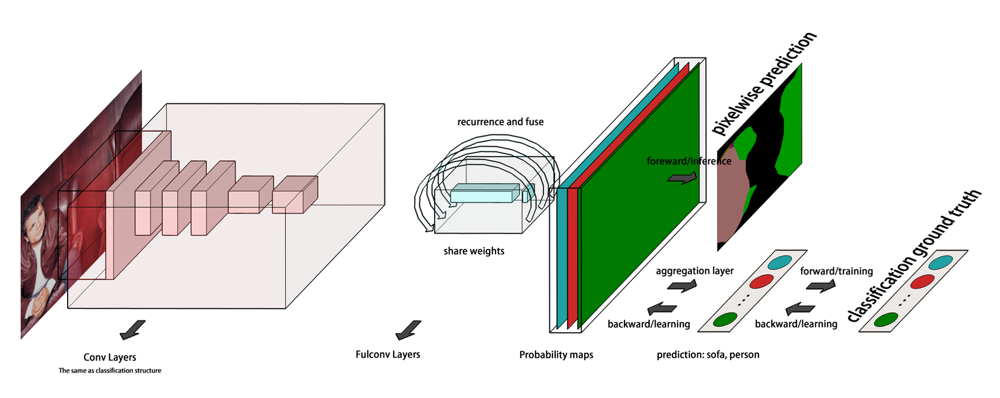

# ringcnn
# Description
This is an implementation about a ring convolution neural network architecture for semantic segmentation.
In my previous research, ring cnn based on FCN acheive better performance in weakly supervised learning for semantic segmentation.

Model | mIoU(voc 2012 val)
------------ | -------------
MIL(baseline)| 0.2409
fcn8s | 0.2500
fcn single 16s | 0.1159
fcn single 32s | 0.2653
fcn single 32s + dialation-block(new weight) | 0.2908
fcn single 32s + ring-block(share weight) | 0.3132
ring-cnn10 | 0.3205
ring-cnn20 | 0.3216
ring-cnn30 | 0.3284

The motivation of ring block is to train the robustness about the variation of receptive fields. 
It enables the expanding of receptive fields while leaving the change to have identity mapping for preserving previous well segmentated objects.
It may seem similar to the residual block while it does not have new weights for deepening the network.
We found it is very useful for weakly supervised semantic segmentation because deepening the network by adding new weights would lead to the loss of local information.

# Requirements
* pytorch 

# ToDo

* Integrating previous weakly supervised semantic segmentation menthod
* Through the preliminary experiments, we found the ring block is not useful for the fully supervised sementic segmentation. We are still working on it.
